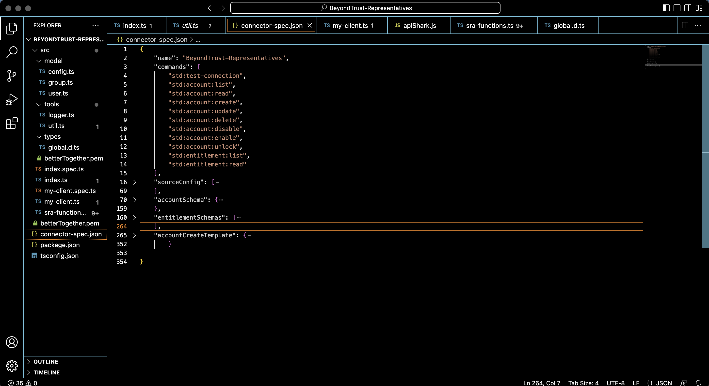
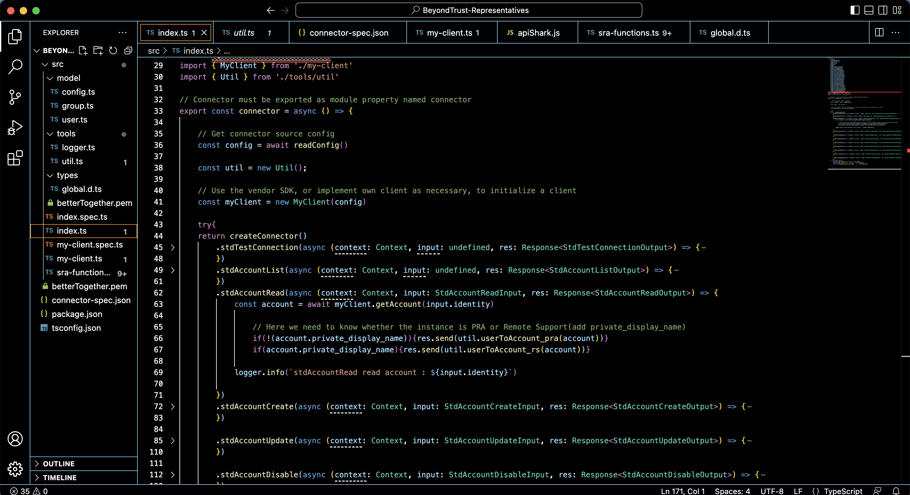
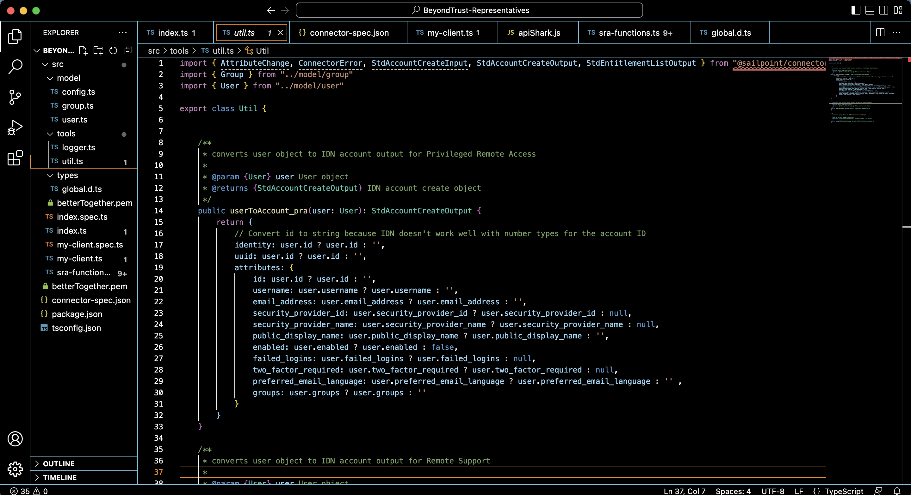

<!DOCTYPE html>
<html>
<body>

<h1># idn_beyondtrust_representatives</h1>

SailPoint IdentityNow SaaS Connector SDK - Remote Support and Privileged Remote Access

  The BeyondTrust Representatives connector capabilities are managed within connector-spec.json.

  
  
  The capability list is used by the IdentityNow instance.  The account and entitlement schemas, and the provisioning policy for new accounts created in SRA, are also included in connector-spec.json.
  
  index.ts leverages tools/util.ts to render responses back to IdentityNow connector.  We also need to determine if the connector is used against PRA or RS, by looking at the presence of the private_display_name attribute specific to Remote Support, and absent in PRA.

  

tools/util.ts includes functions specific to either PRA or Remote Support.

  
  
  

</body>
</html>
