<!DOCTYPE html>
<html>
<body>

<h1># idn_beyondtrust_representatives</h1>

SailPoint IdentityNow SaaS Connector SDK - Remote Support and Privileged Remote Access

  The BeyondTrust Representatives connector capabilities are managed within connector-spec.json.

  
  
  The capability list is used by the IdentityNow instance.  The account and entitlement schemas, and the provisioning policy for new accounts created in SRA, are also included in connector-spec.json.
  
  src/index.ts leverages tools/util.ts to render responses back to IdentityNow connector.  We also need to determine if the connector is used against PRA or RS, by looking at the presence of the private_display_name attribute specific to Remote Support, and absent in PRA.

  

src/tools/util.ts includes functions specific to either PRA or Remote Support.

  
  
src/tools/util.ts leverage model/user.ts and /model/group.ts
  
  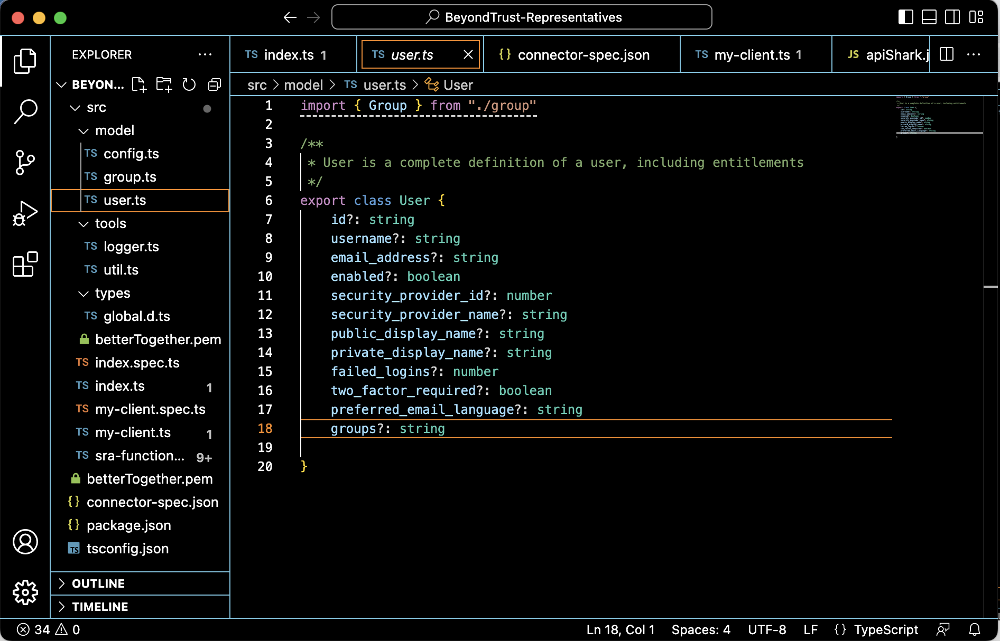

  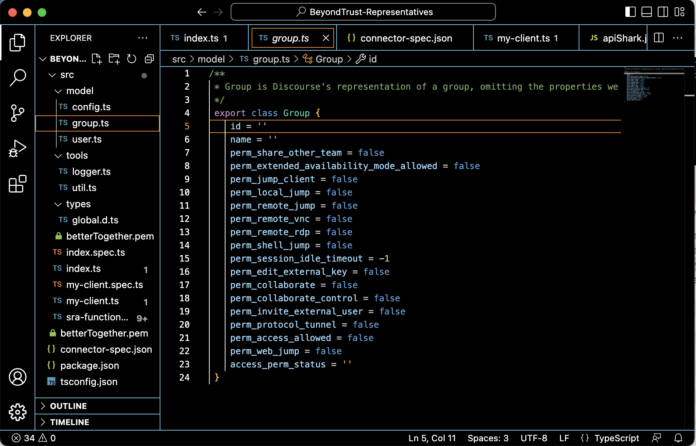

/src/my-client.ts is called by index.ts for each capability.  Each capability start with a test for the Bearer Token, to determine if it is expired or undefined and require re-authentication.
  
   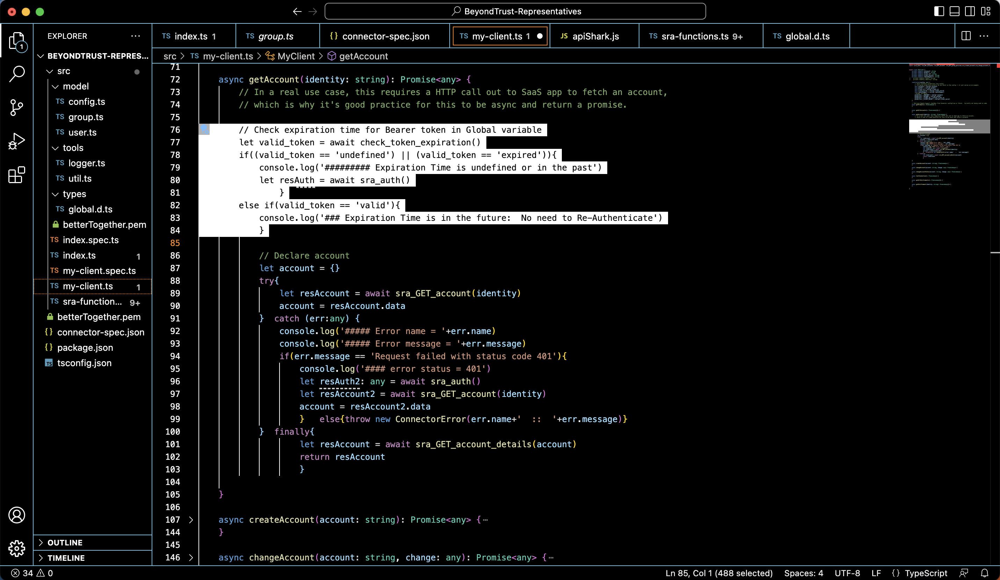
  
Global Variables are used to store the Bearer Token, so as long as the Connector is running, we can reuse the Bearer Token from previous calls, if it is not expired.
  
  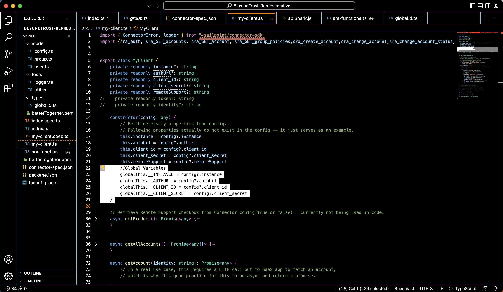

We also need to catch Unauthorized 401 error, which means the Bearer Token we have in Global Variables is invalid despite having a calculated Expiration Time in the future.  This condition can be triggered by changing the instance in configuration after having obtained a Bearer Token from another instance.
  
  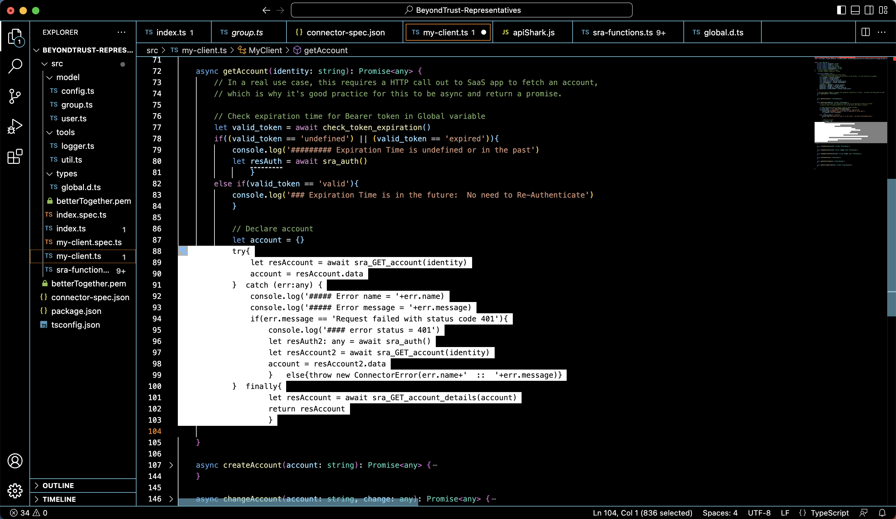
  
  Functions specific to SRA are located in /src/sra-functions.ts.
  
  This is the Authentication function leveraging Global Variables to make the Bearer Token and calculated Expiration Time available globally.
  
  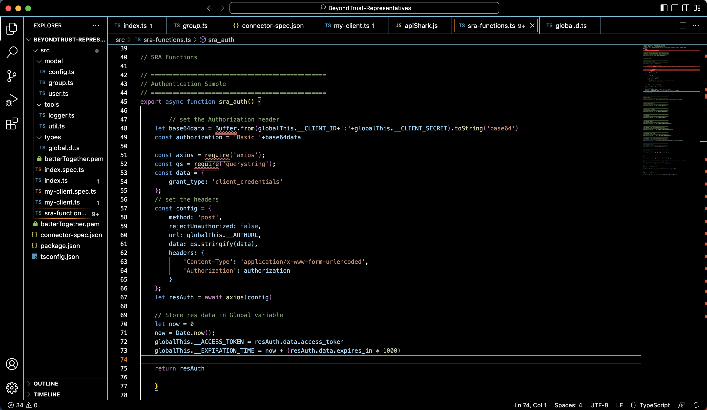
  
  This is the GET User function:
  
  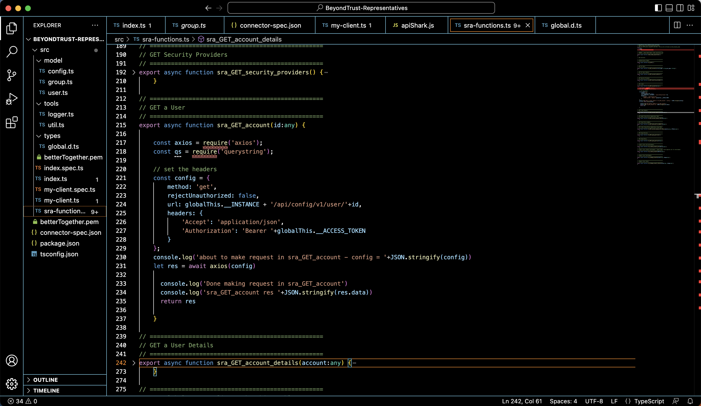
  
  And this is the function that provides a User with details:
  
  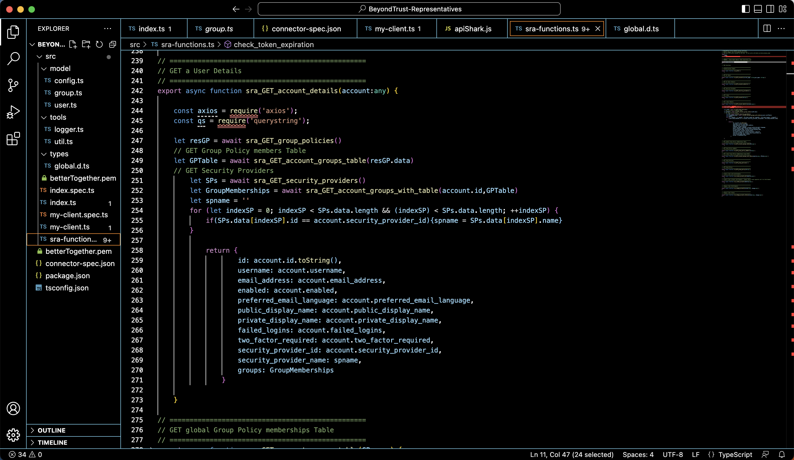
  
  
Load Testing 8-2000 users

  Test data was used to test Aggregation for up to 2000 users in SRA.  Each user is a member of 1 of 3 Group Policies.
  
  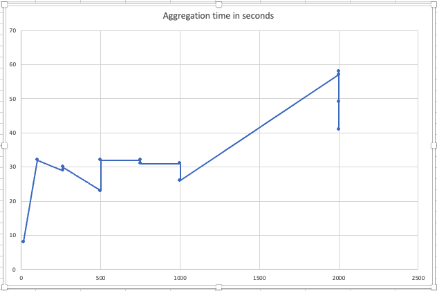

  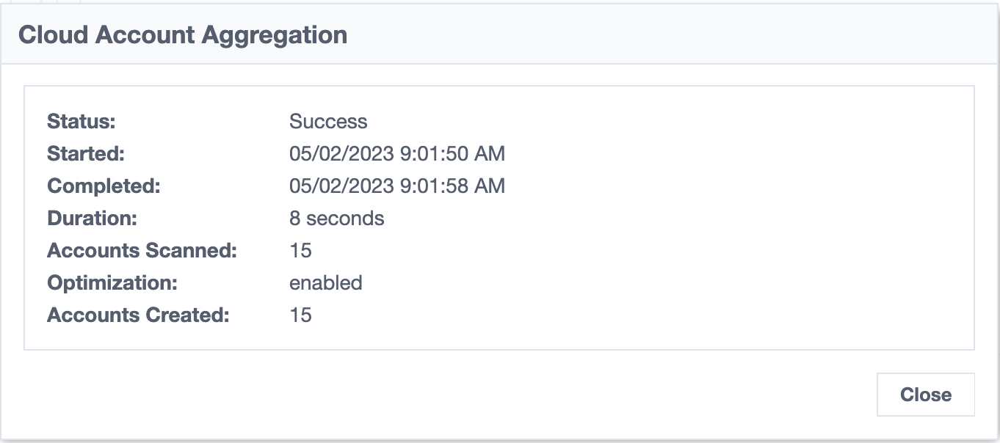
  
  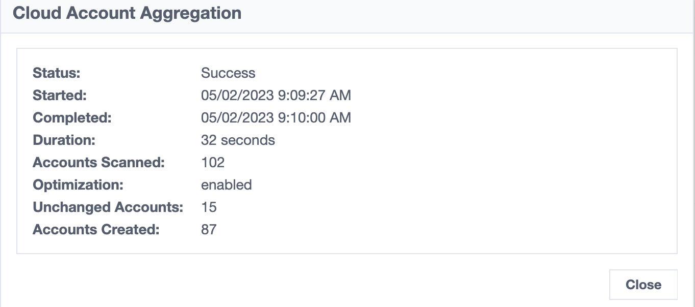
  
  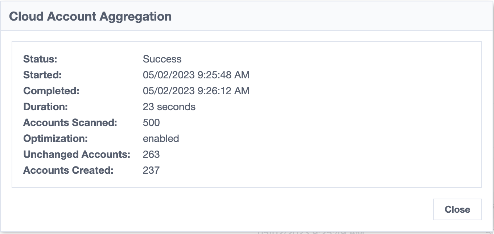
  
  

  
  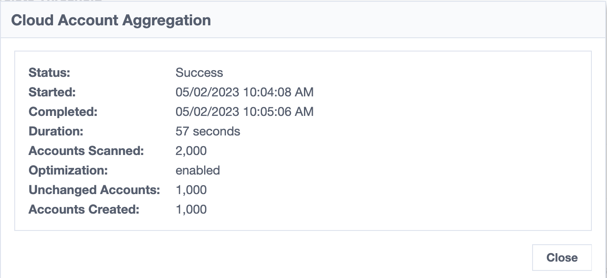

</body>
</html>
