<!DOCTYPE html>
<html>
<body>

<h1>SailPoint IdentityNow SaaS Connector SDK :: BeyondTrust Representatives</h1>

<h2>Remote Support and Privileged Remote Access</h2>
  
  The BeyondTrust Representatives connector has been created using the <a href="https://developer.sailpoint.com/idn/docs/saas-connectivity/">SailPoint IdentityNow SaaS Connector SDK</a>.
  
  Remote Support and Privileged Remote Access both include Representatives and the only difference between the 2 products is that Remote Support has an extra mandatory attribute:  private_display_name.  Below is a User in Privileged Remote Access. 
  
   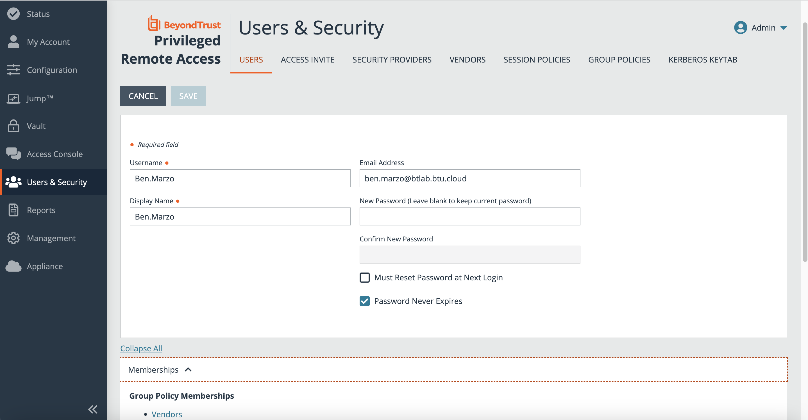
  
  Group Policies are used as Groups with the Connector.
  
   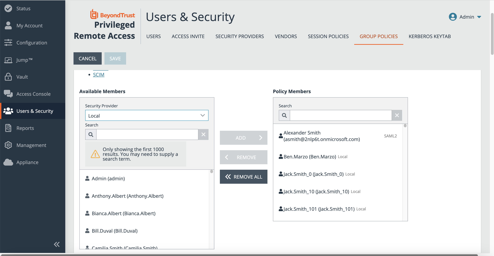

   
  
  An API service account needs to be created for the Connector.
  
   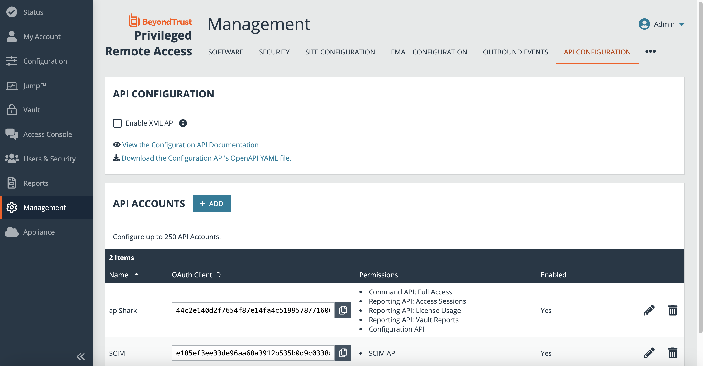

  API service account permissions.
  
   

  The API documentation is available via the Management API section.
  
   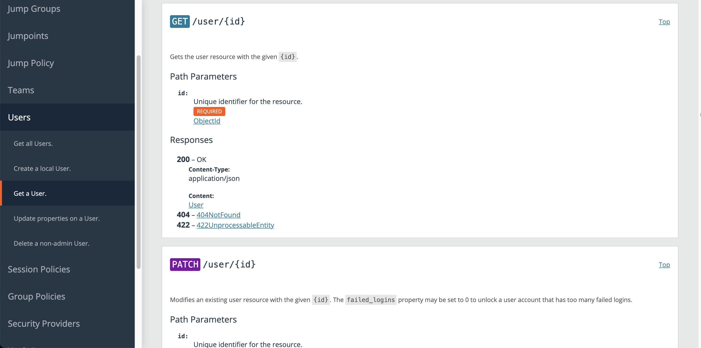
  
  Connector Configuration in IdentityNow.
  
   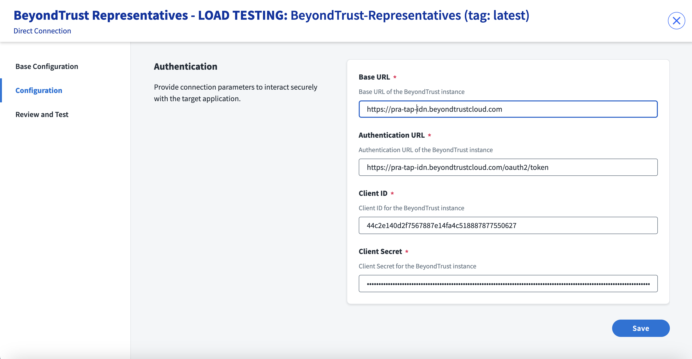
  
   SRA Accounts in IdentityNow.
  
   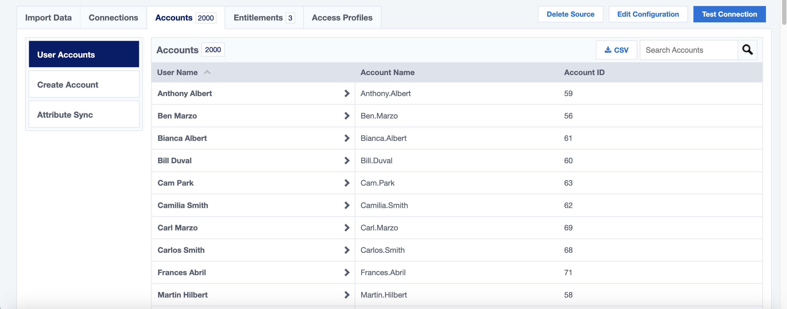

  SRA Entitlements in IdentityNow.
  
   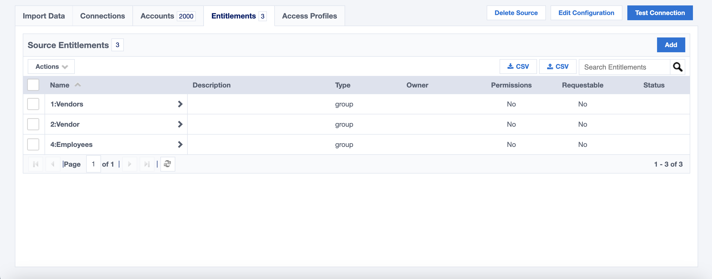
 
  Representatives Connector - Create Account(provisioning policy) in IdentityNow.
  
   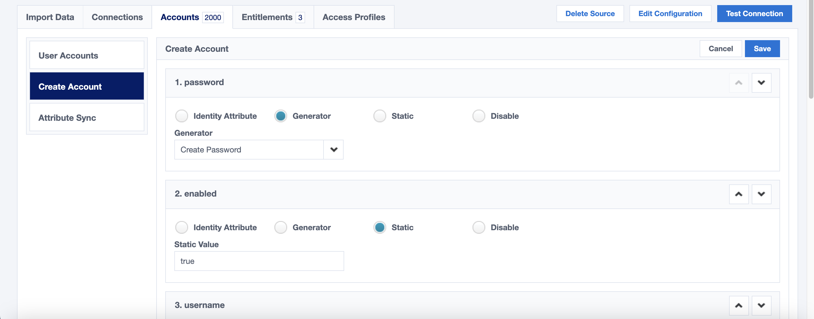
  

<h2>Code structure overview</h2>
  
  The BeyondTrust Representatives connector capabilities are managed within connector-spec.json.

  
  
  The capability list is used by the IdentityNow instance.  The account and entitlement schemas, and the provisioning policy for new accounts created in SRA, are also included in connector-spec.json.
  
  src/index.ts leverages tools/util.ts to render responses back to IdentityNow connector.  We also need to determine if the connector is used against PRA or RS, by looking at the presence of the private_display_name attribute specific to Remote Support, and absent in PRA.

  

src/tools/util.ts includes functions specific to either PRA or Remote Support.

  
  
src/tools/util.ts leverage model/user.ts and /model/group.ts
  
  

  

/src/my-client.ts is called by index.ts for each capability.  Each capability start with a test for the Bearer Token, to determine if it is expired or undefined and require re-authentication.
  
   
  
Global Variables are used to store the Bearer Token, so as long as the Connector is running, we can reuse the Bearer Token from previous calls, if it is not expired.
  
  

We also need to catch Unauthorized 401 error, which means the Bearer Token we have in Global Variables is invalid despite having a calculated Expiration Time in the future.  This condition can be triggered by changing the instance in configuration after having obtained a Bearer Token from another instance.
  
  
  
  Functions specific to SRA are located in /src/sra-functions.ts.
  
  This is the Authentication function leveraging Global Variables to make the Bearer Token and calculated Expiration Time available globally.
  
  
  
  This is the GET User function:
  
  
  
  And this is the function that provides a User with details:
  
  
  
  <h2>Load Testing 8-2000 users</h2>

  Test data was used to test Aggregation for up to 2000 users in SRA.  Each user is a member of 1 of 3 Group Policies.
  
  

  
  
  
  
  
  
  

  
  

<h2>Error handling</h2>
  
  <h3>Invalid host in Configuration:  Test Connection.</h3>
  
   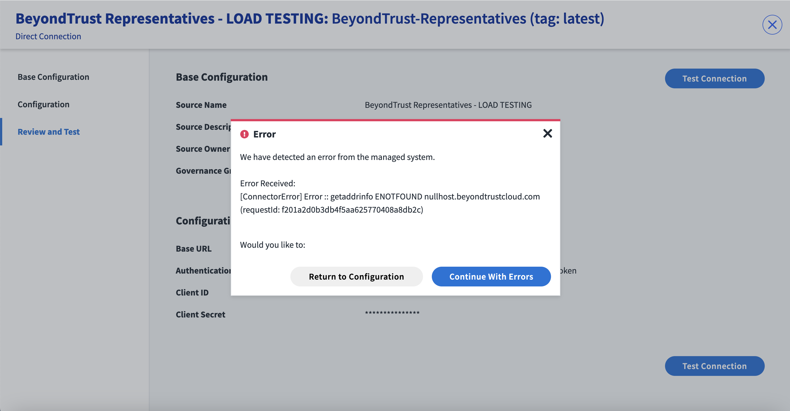
   
   But with Smart Error Handling function, we can present a more informative error message to the user:
   
     

  <h3>Invalid credentials in Configuration:  Test Connection.</h3>
  
   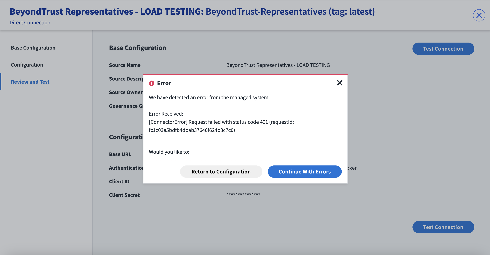
   
   But with Smart Error Handling, we are presenting a more informative message.
  
   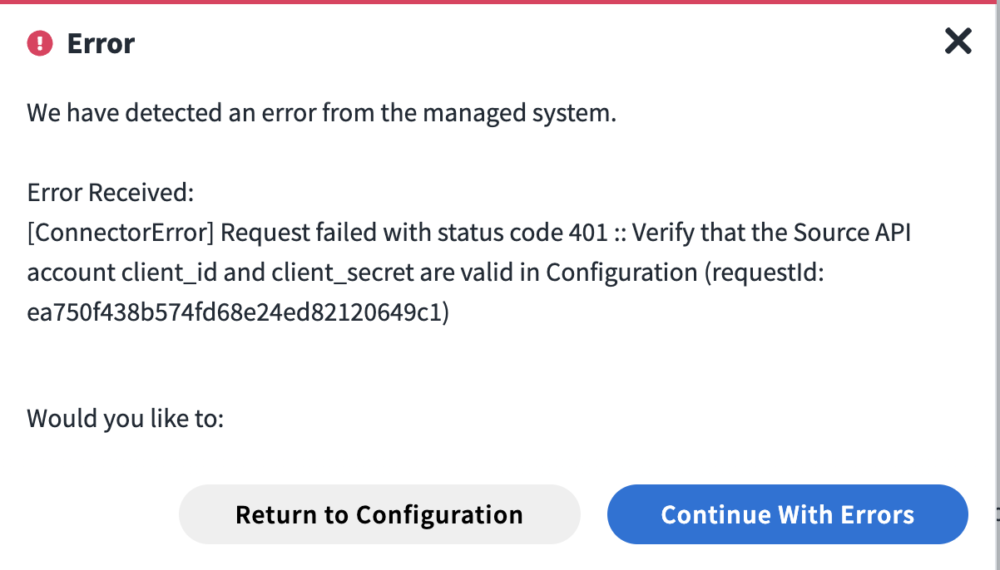
 
  <h3>Invalid non-expired Bearer Token.</h3>
  
  This condition is created by changing the Configuration to point to a different instance(requires 2 RS/PRA instances).
  The Connector logic first checks the expiration time, and assumes that the Bearer Token is still valid, so it attemps a call(e.g. GET User) 
  but the  call fails with Unauthorized 401 error.  The Connector handles this error condition by discarding the Bearer Token 
  and forcing re-authentication.
  
  Switching back and forth between instances and using Test Connection(within Configuration) should result in Success, because the Error condition is catched and handled by code.
  
   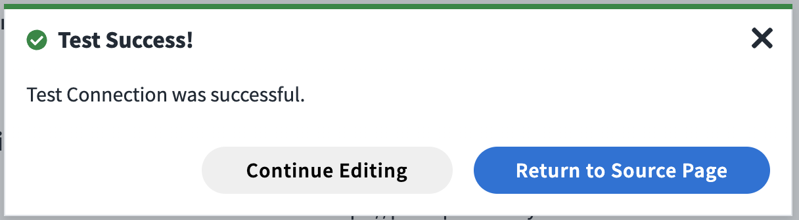

  <h3>Invalid URL path</h3>
  
  This can be created when the host portion of the URL is valid, but not the path.
 
   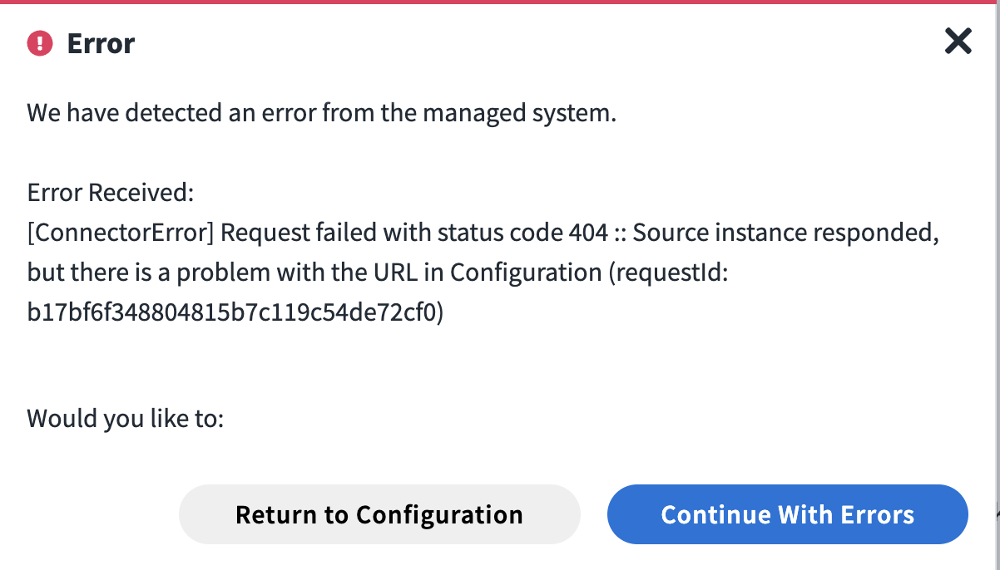

  <h3>Missing permission in Source for API Account</h3>
  
  This can be created by a lack of permission in Source.
 
   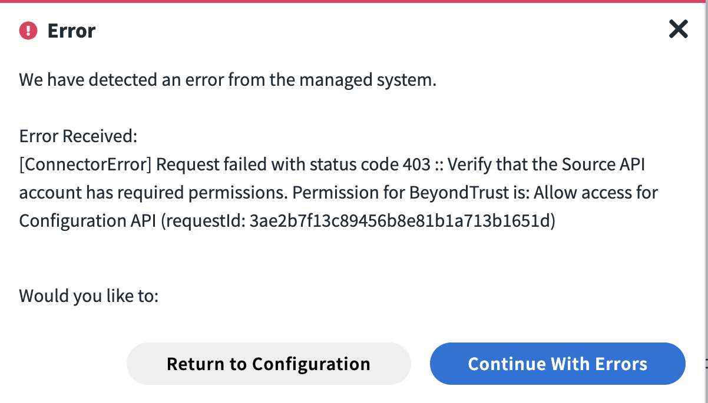

  <h3>Trailing slash character in either instance or authentication URL</h3>
  
  Logic included in my-client.ts to remove trailing character to avoid error 405.
  
  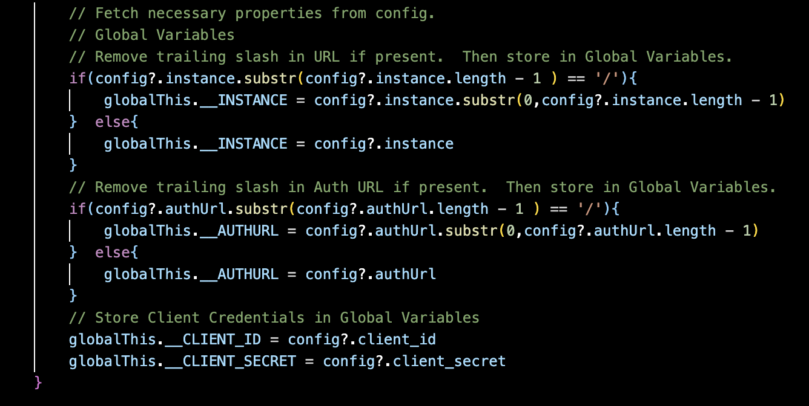

  
</body>
</html>
